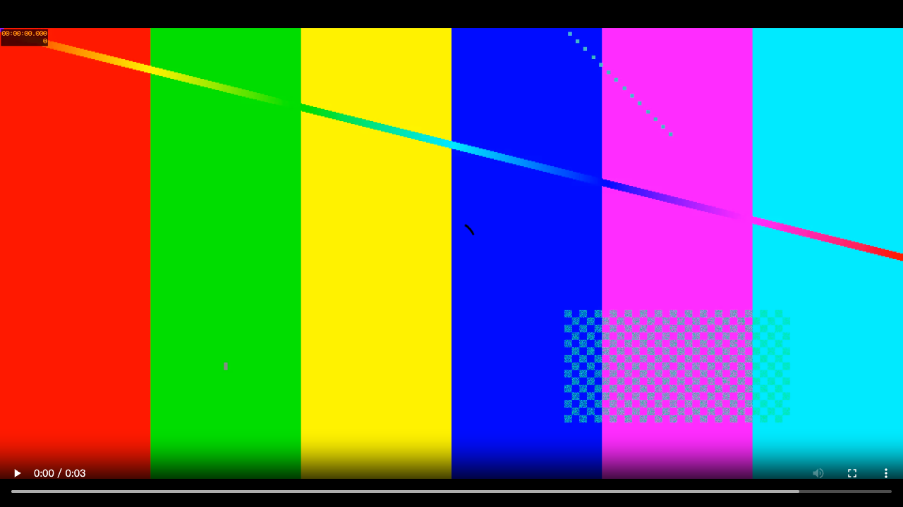
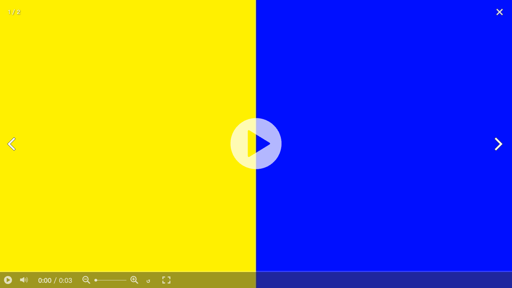

# Spherical MP4 playback

The shared Web viewer used by Photos and public albums automatically opens
tagged, stitched, full-sphere monoscopic equirectangular MP4 videos in an
interactive player. It uses Photo Sphere Viewer 5.15.1, its equirectangular video
adapter, and its video plugin. Ordinary videos retain the existing player.

## Detection and storage

MP4Box 2.4.1 parses the movie container; a small interpreter reads Google
[Spherical Video V1](https://github.com/google/spatial-media/blob/master/docs/spherical-video-rfc.md)
UUID XML and
[V2](https://github.com/google/spatial-media/blob/master/docs/spherical-video-v2-rfc.md)
`sv3d/proj` boxes. V2 takes precedence. A 2:1 aspect ratio alone never marks a
file as spherical. The parser reads top-level headers and the `moov` box, skipping
media payloads, and caps metadata at 16 MiB and the top-level scan at 1024 boxes.

Browser uploads save `sphericalVideoChecked` and, for positive detection,
projection, stereo layout, crop status, and V2 pose in encrypted public magic
metadata. "Public" metadata remains encrypted and is available to people with
access to the album. Detection failures leave the file uninspected and never
prevent upload. No backend media processing is added.

Legacy files are inspected from decrypted original bytes before any browser
compatibility conversion. Files with uninspected 2:1 HLS previews also fetch the
original for inspection; other existing HLS previews retain their fast path.
Viewing fallback results remain in the existing local viewer/download caches;
viewing does not write remote metadata or race with caption/location edits.
Native desktop-path uploads rely on this viewing fallback.

## Playback and limits

Detected spherical videos use the original-quality playable source rather than
existing low-resolution HLS previews. Playback still uses Ente's original
client-side download, decryption, caching, and compatibility conversion. The
panorama renderer and parser are loaded lazily.

The player provides dragging/touch rotation, play/pause, volume, timeline, zoom,
reset view, and fullscreen. Gallery keyboard playback shortcuts use the same
video element. Switching slides pauses playback and destroys the renderer;
returning retains the video element and playback position. Async initialization
is guarded against navigation before import or metadata loading completes.

Unsupported tagged stereo, cropped, cubemap, and mesh projections show an
explanation instead of a flat fallback. This version does not handle OSV,
inject missing spherical tags, render WebM panorama tags, create high-quality
spherical HLS, or modify Flutter. V1 initial-view angles are currently ignored;
V2 projection pose is applied. Legacy non-2:1 HLS files may require selecting
Original to inspect their tags. Codec support and device GPU limits still apply.
Large originals must finish downloading/decrypting before playback can start.

## Validation

Run the automated Photos tests from `web`:

```sh
npm test --workspace photos
```

Spherical tests cover V1/V2 parsing, precedence, cropped/stereo layouts, bounded
reads, malformed input, ordinary 2:1 files, HLS routing, metadata preservation
before conversion, and cancellation/revisiting of the renderer. An optional
local file can be checked without adding its bytes to the repository:

```sh
ENTE_SPHERICAL_SAMPLE=/absolute/path/video.mp4 npm test --workspace photos -- spherical-video.test.ts
```

A local isolated integration harness exercised the real renderer with
PhotoSwipe and a synthetic H.264 video in desktop Chrome and Chrome mobile
touch emulation. Checks included rotation without album swiping, play/pause,
revisiting a slide, fullscreen, and cleanup on close. These are not end-to-end
tests of the deployed Photos/public-albums applications or real iOS Safari.

The following screenshots compare flat playback and the interactive spherical
view of the same synthetic clip in that harness; they contain no user footage.

| Flat playback                  | Spherical playback                 |
| ------------------------------ | ---------------------------------- |
|  |  |

Photos, public-albums, and Accounts production builds and type checks pass in a
Linux builder after generating the Photos and Prelogin WASM packages. Real
logged-in/public-link end-to-end playback and iOS Safari/HEVC playback remain to
be verified.
